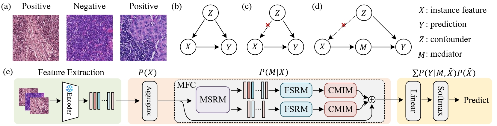

# MFC-MIL
The official implementation of "[A Multiscale Frequency Domain Causal Framework for Enhanced Pathological Analysis](https://openreview.net/pdf?id=6xrDPHhwD3). (ICLR 2025)"

## Abstract



Multiple Instance Learning (MIL) in digital pathology Whole Slide Image (WSI) analysis has shown significant progress. However, due to data bias and unobservable confounders, this paradigm still faces challenges in terms of performance and interpretability. Existing MIL methods might identify patches that do not have true diagnostic significance, leading to false correlations, and experience difficulties in integrating multi-scale features and handling unobservable confounders. To address these issues, we propose a new Multi-Scale Frequency Domain Causal framework (MFC). This framework employs an adaptive memory module to estimate the overall data distribution through multi-scale frequency-domain information during training and simulates causal interventions based on this distribution to mitigate confounders in pathological diagnosis tasks. The framework integrates the Multi-scale Spatial Representation Module (MSRM), Frequency Domain Structure Representation Module (FSRM), and Causal Memory Intervention Module (CMIM) to enhance the model's performance and interpretability. Furthermore, the plug-and-play nature of this framework allows it to be broadly applied across various models. Experimental results on Camelyon16 and TCGA-NSCLC dataset show that, compared to previous work, our method has significantly improved accuracy and generalization ability, providing a new theoretical perspective for medical image analysis and potentially advancing the field further. 

## Usage
  ### 1. Installation

  ```
  # clone the repository
  git clone https://github.com/WissingChen/CRA-GQA.git

  # create a conda environment
  conda env create -f requirements.yml
  ```

  ### 2. Dataset

   #### Preprocess TCGA Dataset

>We use the same configuration of data preprocessing as [DSMIL](https://github.com/binli123/dsmil-wsi).

   #### Preprocess CAMELYON16 Dataset

>We use [CLAM](https://github.com/mahmoodlab/CLAM/tree/master) to preprocess CAMELYON16 at 20x.
>For your own dataset, you can modify and run [create_patches_fp_Lung.py](https://github.com/titizheng/PAMIL/blob/main/slide_preproce/create_patches_fp_Lung.py) and [extract_features_fp_LungRes18Imag.py](https://github.com/titizheng/PAMIL/blob/main/slide_preproce/extract_features_fp_LungRes18Imag.py).


The data used for training, validation and testing are expected to be organized as follows:
```bash
DATA_ROOT_DIR/
    ├──DATASET_1_DATA_DIR/
        └── pt_files
                ├── slide_1.pt
                ├── slide_2.pt
                └── ...
        └── h5_files
                ├── slide_1.h5
                ├── slide_2.h5
                └── ...
    ├──DATASET_2_DATA_DIR/
        └── pt_files
                ├── slide_a.pt
                ├── slide_b.pt
                └── ...
        └── h5_files
                ├── slide_i.h5
                ├── slide_ii.h5
                └── ...
    └── ...
```

### 3. Train
First, after preparing the data, you should modify the relevant parameters in the `config` folder, including the data path, etc.

Then, you can simply run the `main.py` file directly.

## Citation 
```
@inproceedings{cuimultiscale,
  title={A Multiscale Frequency Domain Causal Framework for Enhanced Pathological Analysis},
  author={Cui, Xiaoyu and Chen, Weixing and Su, Jiandong},
  booktitle={The Thirteenth International Conference on Learning Representations},
  year={2025},
}
```